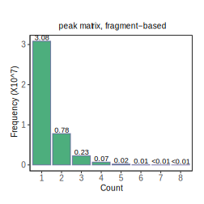

<!-- README.md is generated from README.Rmd. Please edit that file -->

# PICsnATAC

<!-- badges: start -->
<!-- badges: end -->

The goal of PICsnATAC is to accurately quantify snATAC-seq data. The two
key components are:

#### 1. <span style="text-decoration:underline">Constructing cell-by-peak matrix</span> with Paired Insertion Counting (PIC).

##### **Motivation**:

There are two common counting approaches for snATAC-seq data,
**fragment-based counting** and **insertion-based counting**. They
generate inconsistent results (see figure below).

<div style="display: flex;">




</div>

*Here, we present PIC as a uniform counting choice for various assays,
including 10X Genomics snATAC-seq, sci-ATAC-seq, SNARE-seq,
dsc-ATAC-seq, s3-ATAC-seq, and scNANO-ATAC.*

#### 2. Conducting <span style="text-decoration:underline">Differential Accessible Region (DAR)</span> identification analysis using the PIC matrix.

##### **Motivation**:

Two insertion events with correct primer configurations are required for
one viable fragment. We derived the **probability distribution of
fragment count** as a function of insertion rate and derived a
**model-based insertion rate estimation framework**. We further applied
a likelihood ratio test approach to detect DARs between populations.


*Building upon our model-based insertion rate estimation framework, this
analysis provides a more sensitive test of DAR between cell groups (cell
types).*

## Dependencies

Please install the dependent libraries by running the following codes

``` r
install.packages('data.table') ## (please make sure it is newer than 1.8)
if (!require("BiocManager", quietly = TRUE))
    install.packages("BiocManager")
BiocManager::install(c('IRanges', 'GenomicRanges','Rsamtools', 'GenomeInfoDb'))
```

## Installation

You can install the most up-to-date version of PICsnATAC from
[GitHub](https://github.com/Zhen-Miao/PICsnATAC) with:

``` r
# install.packages("devtools")
devtools::install_github("Zhen-Miao/PICsnATAC")
```

PIC-snATAC is a light-weight package. Installation typically takes \<5
min.

## Example

This is a basic example which shows you how to construct PIC-based cell
by peak matrix:

``` r
library(PICsnATAC)

pic_matrix <- PIC_counting(cells, fragment_tsv_gz_file_location, peak_sets)
```

## Vignettes

The vignettes can be found at our `pkgdown` page:

<https://zhen-miao.github.io/PICsnATAC/>

## Interactive Notebooks

*Here, we provided two Google Colab notebooks for users to run the codes
on cloud (processed example data and link provided). However, as
snATAC-seq data are typically large and computer intensive, it is
recommended to run it using computing cluster for large datasets*

Notebook 1: [Run PIC counting on PBMC
data.](https://github.com/Zhen-Miao/PICsnATAC/blob/main/vignettes/Run_PIC_counting_on_pbmc_3k_data.ipynb)

Notebook 2: [Run PIC DAR on SNARE-seq2 brain
data.](https://github.com/Zhen-Miao/PICsnATAC/blob/main/vignettes/Run_PIC_on_human_brain_data.ipynb)

## Citation

If you use PICsnATAC in your research, please cite our paper:

Miao Z and Kim J. **Uniform quantification of single-nucleus ATAC-seq
data with Paired- Insertion Counting (PIC) and a model-based insertion
rate estimator.** *Nature Methods* 2023 (In press)
